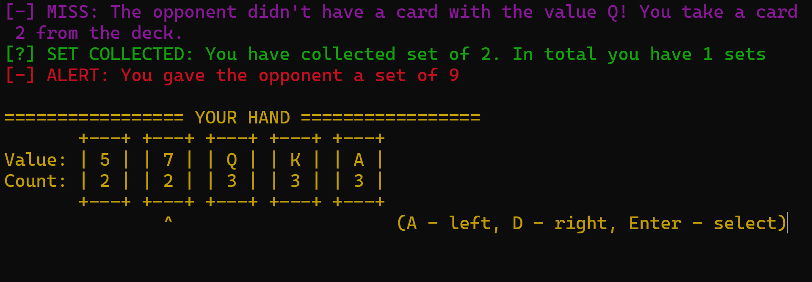

# 🃏 Сундучки (Go Fish) — C++ & x64 Assembly (MASM)

Консольная реализация классической карточной игры «Сундучки» (Go Fish) с интерактивным интерфейсом и уникальной технической особенностью: **искусственный интеллект противника написан на чистом языке ассемблера x64 (с использованием макроассемблера MASM)**.

---

## 📟 Интерфейс игры


---

## ✨ Особенности игры

* **Умный и хитрый соперник:** Искусственный интеллект противника играет как реальный человек. Он не просто перебирает свои карты наугад, а внимательно следит за вашими действиями, запоминает, какие карты вы искали, и пытается перехватить их в самый неожиданный момент.
* **Удобное управление:** Выбирайте карты для хода визуально с помощью клавиш A и D, а подтверждайте выбор нажатием Enter — указатель плавно перемещается прямо по вашей колоде.
* **Яркий визуальный стиль:** Игровое поле оформлено красивой ASCII-графикой, а динамическая цветовая разметка помогает мгновенно считывать ситуацию на столе боковым зрением: ваши успехи подсвечиваются зеленым, карты сияют золотом, а опасные действия соперника выделяются тревожным красным.
* **Игра без ограничений:** Вы можете играть партию за партией столько, сколько захотите. Сразу после финального хода игра предложит мгновенно начать новую, сохраняя при этом общую статистику побед и поражений за всю сессию.

---

## 🎮 Как играть

**Цель игры:** Собрать как можно больше "сундучков" (сетов из 4-х одинаковых карт одного номинала). Всего в игре 13 сундучков.

1. В начале раунда каждый игрок получает по 7 карт.
2. В свой ход вы выбираете номинал карты из тех, что **уже есть у вас на руках**, и спрашиваете её у противника.
3. Если у противника есть карты этого номинала, он обязан отдать их все вам. И ход переходит к оппоненту.
4. Если таких карт нет, противник отвечает отказом, и вы берете одну карту из колоды. И ход переходит к оппоненту.
5. Как только собирается 4 одинаковые карты, они превращаются в "сет" и откладываются в вашу копилку.
6. Побеждает тот, кто к концу игры соберет больше сетов (7 и более).

### Управление
* `A` — Переместить указатель влево
* `D` — Переместить указатель вправо
* `Enter` — Спросить выбранную карту у противника
* `Esc` — Выйти из игры (на экране результатов)

---

## 🛠 Технический стек и структура

* **Язык разработки:** C++ (стандарт C++11 и выше), Assembly x64 (MASM).
* **Среда:** Разработано и протестировано в Microsoft Visual Studio.
* **ОС:** Windows (используется `<conio.h>` для перехвата нажатий клавиш без ожидания `Enter`).

### Структура проекта
* `SetsOfCards` — Класс, отвечающий за инициализацию колоды, раздачу карт, подсчет и хранение массивов карт на руках и в памяти.
* `GameLoop` — Основной цикл игры, отрисовка интерфейса, обработка правил, проверка сетов и логирование ходов.
* `choose_opponent_card proc` — Внешний ассемблерный модуль. Принимает указатели на массивы (`opponent_cards`, `eventual_cards`) через регистры `RCX` и `RDX`, обрабатывает их и возвращает индекс оптимальной карты для хода.

---

## 🚀 Установка и запуск

Вы можете скачать уже готовую игру или скомпилировать её самостоятельно, если хотите изучить код.

### Вариант 1: Скачать и играть (Рекомендуемый)
Вам не нужны компиляторы или среды разработки, чтобы просто поиграть:
1. Перейдите в раздел **[Releases](https://github.com/NikTak777/go-fish-card-game/releases)** справа на странице репозитория.
2. Скачайте исполняемый `.exe` файл из последнего релиза.
3. Запустите файл двойным кликом. *(Примечание: для корректного отображения цветов требуется Windows 10/11).*

### Вариант 2: Сборка из исходников (Для разработчиков)
Проект настроен для сборки в **Microsoft Visual Studio**. Для работы ассемблерных вставок обязательна компиляция под архитектуру **x64**.
1. Склонируйте репозиторий на свой компьютер:
   ```bash
   git clone [https://github.com/NikTak777/go-fish-card-game.git](https://github.com/NikTak777/go-fish-card-game.git)
   ```
2. Откройте проект в Visual Studio (откройте файл решения .sln, если он есть, либо создайте пустой проект и добавьте туда скачанные исходники).
3. Убедитесь, что включена поддержка Ассемблера: Нажмите правой кнопкой мыши по проекту -> Сборка зависимостей (Build Dependencies) -> Настройки сборки (Build Customizations) -> поставьте галочку напротив masm.
4. Проверьте свойства ассемблерного файла: Нажмите правой кнопкой мыши по .asm файлу -> Свойства (Properties) -> Тип элемента (Item Type) -> убедитесь, что выбрано Microsoft Macro Assembler.
5. Важно: Проверьте, что платформа сборки установлена строго на x64 (в верхней панели Visual Studio).
6. Скомпилируйте и запустите игру (F5).

---

## 📄 Лицензия

Этот проект распространяется под лицензией **MIT**. Вы можете свободно использовать, изменять и распространять код. Подробности смотрите в файле лицензии.
